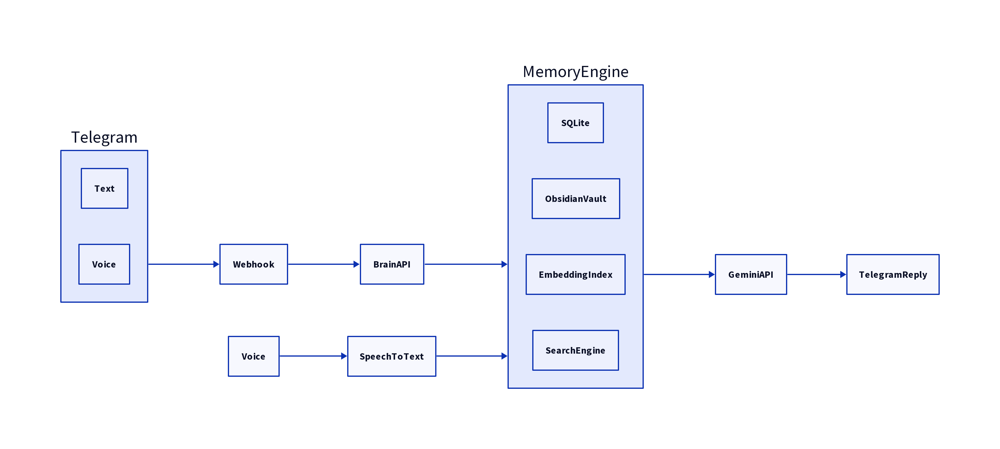

# Proyecto Brain: Sistema de Memoria Permanente con IA

## Descripción General

**Brain** es un sistema de memoria permanente con inteligencia artificial, diseñado para interactuar con el usuario a través de Telegram. A diferencia de un chatbot tradicional, Brain está construido para recordar información útil de forma indefinida, organizar el conocimiento automáticamente y utilizarlo para proporcionar respuestas contextualizadas. El proyecto está completamente desarrollado en TypeScript y utiliza la API de Google Gemini para sus capacidades de IA.

## Objetivos

El objetivo principal de Brain es actuar como una extensión de la memoria del usuario, permitiéndole interactuar de forma natural a través de Telegram. Sus funciones clave incluyen:

-   **Respuestas Naturales**: Generar respuestas coherentes y contextualizadas.
-   **Memoria Permanente**: Almacenar información relevante de forma indefinida.
-   **Contexto Temporal**: Olvidar automáticamente el contexto conversacional no esencial.
-   **Organización Automática**: Clasificar y organizar el conocimiento sin intervención manual del usuario.
-   **Búsqueda de Conocimiento**: Consultar la memoria existente antes de formular una respuesta.

## Arquitectura

La arquitectura de Brain está diseñada para ser modular y escalable, permitiendo una fácil integración y abstracción de los componentes clave. El flujo de información principal es el siguiente:

Telegram → Webhook → Brain API → Memory Engine → Gemini API → Telegram Reply

El **Memory Engine** es el corazón del sistema y se compone de los siguientes módulos:

-   **Memoria Corta**: Almacena conversaciones recientes, temas actuales y tareas temporales. Implementada con SQLite y con una expiración configurable (por defecto, 30 días).
-   **Memoria Larga**: Contiene el conocimiento permanente, almacenado en un **Obsidian Vault** utilizando archivos Markdown. Cada nota de memoria larga sigue un formato específico y se organiza en carpetas temáticas.
-   **Embedding Index**: Índice de embeddings generados a partir de las notas de memoria larga, utilizado para la búsqueda semántica.
-   **Search Engine**: Motor de búsqueda que utiliza los embeddings para recuperar las notas más relevantes antes de responder a una consulta.

### Diagrama de Arquitectura



## Componentes Clave

### Memoria Corta

-   **Propósito**: Mantener la continuidad de la conversación y el contexto temporal.
-   **Almacenamiento**: Conversaciones recientes, temas actuales, tareas temporales, contexto reciente.
-   **Expiración**: 30 días (configurable mediante variable de entorno `SHORT_MEMORY_EXPIRATION`).
-   **Implementación**: SQLite.

### Memoria Larga

-   **Propósito**: Almacenar conocimiento permanente y estructurado.
-   **Almacenamiento**: Dentro de un Obsidian Vault, donde cada memoria es un archivo Markdown.
-   **Ejemplos de Contenido**: Estrategias de negocio, decisiones de CRM, automatizaciones, ideas, lecciones, errores, procesos, experimentos, prompts, arquitectura.
-   **Regla Clave**: Nunca guardar conversaciones inútiles.

### Clasificador Automático de Memoria

Para cada mensaje recibido, el sistema decide si debe convertirse en conocimiento permanente. Si la decisión es 
YES, se genera o actualiza un archivo Markdown. Si es NO, se responde normalmente.

### Obsidian Vault

-   **Estructura del Vault**:
    ```
    Vault/
    ├── CRM/
    ├── Sales/
    ├── Automation/
    ├── Prompts/
    ├── Ideas/
    ├── Projects/
    ├── Bugs/
    ├── Experiments/
    ├── Processes/
    ├── Knowledge/
    ├── Meetings/
    ├── AI/
    ├── Architecture/
    └── Daily/
    ```
-   La IA elige automáticamente la carpeta correcta para cada nota.

### Formato Markdown

Cada nota Markdown debe contener:

-   **Frontmatter**: Título, Creado, Actualizado, Etiquetas, Alias.
-   **Secciones**: Resumen, Contexto, Conocimiento, Notas Relacionadas, Próximos Pasos.
-   **Enlaces Wiki**: Creación automática de enlaces wiki (ej. `[[CRM]]`, `[[Cloudflare]]`, `[[Telegram]]`).

### Detección de Duplicados

-   Nunca se deben crear notas duplicadas.
-   Si existe una nota similar, se debe actualizar la existente.

### Búsqueda

-   Antes de responder a cualquier pregunta, se realiza una búsqueda en la memoria semántica.
-   Se recuperan las notas más relevantes y se inyectan en el modelo Gemini.
-   La respuesta se genera utilizando este conocimiento. Nunca se responde solo desde la memoria del modelo si Brain ya tiene conocimiento relevante.

### Embeddings

-   Cada nota Markdown genera embeddings.
-   Cuando una nota cambia, sus embeddings se regeneran automáticamente.

### Telegram

-   **Soporte Actual**: Texto, Voz.
-   **Soporte Futuro**: Imágenes, Documentos.

### Voz

El flujo para mensajes de voz es:

Voz → Speech to Text → Memory Engine → Gemini → Respuesta

## Configuración

Todas las configuraciones se gestionan a través de variables de entorno.

## Calidad del Código

-   Arquitectura modular.
-   Inyección de dependencias.
-   Sin lógica duplicada.
-   Código limpio.
-   Listo para producción.
-   Documentación completa.

## Preparado para el Futuro

El proveedor de LLM está abstraído, permitiendo cambiar entre Gemini (actual), OpenAI, Claude, Grok, etc., sin modificar el resto del código.

## Entregables

-   Proyecto completo.
-   Estructura de carpetas.
-   README.
-   Guía de instalación.
-   Guía de despliegue.
-   Variables de entorno.
-   Explicación de la arquitectura.
-   Diagramas de secuencia.
-   Código completo.
